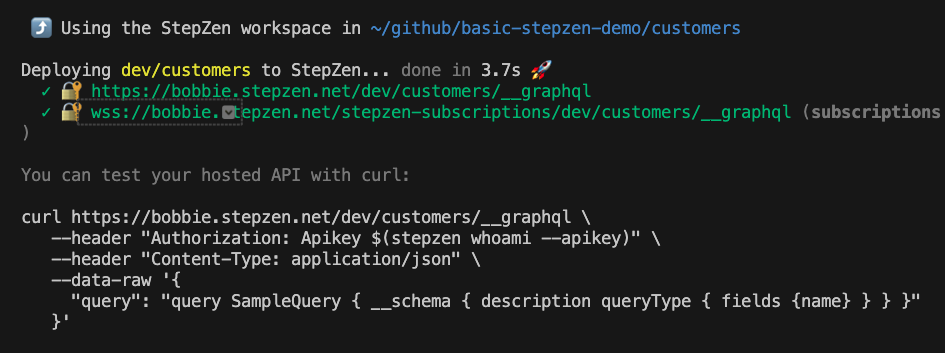

# basic-stepzen-demo
## A simple and quick demo for StepZen

This demo includes three separate GraphQL APIs.
1. A "customers" API built from a REST endpoint
1. An "orders" API built from a mysql database
1. A "federation" API that joins the first two together

## Premise
Two teams are building their domain services as GraphQL, a third "enterprise" team is creating a federated enterprise graphql service from the domain services.


## Setup
First, ensure you have the stepzen cli installed:
```
npm install -g stepzen
```
> **Note** 
> consider using nvm or similar to make keeping your node environment up to date easier

Next, clone the repo.  For simplicity of running the demo, you can either substitute YOUR_STEPZEN in this readme with your stepzen account and domain prefex (i.e. `carlos.stepzen.net`), or set an enviornment variable in your terminal. (i.e. export YOUR_STEPZEN=`carlos.stepzen.net`, except use YOUR stepzen account)

Finally, log in to stepzen, either Trial Version, Essentials, or Locally
1. Trial Version
   ```
   stepzen login -a { username }
   ``` 
   With the { username } and { Admin Key } from your [account page](https://dashboard.stepzen.com/account).
1. Essential
   You can find the correct login commaind on the instance launch page.  It will be of the form:
   ```
   stepzen login { domain } -a { environment }
   ```
   With the { domain }, { environment }  and { Admin Key } from your IBM StepZen Graph Server instance page, which you can launch from the [IBM SaaS Console Subscriptions page](https://console.saas.ibm.com/dashboard/subscriptions).
   > **Note** in case of staging, this is [IBM SaaS Console Test Subscriptions page](https://console.test.saas.ibm.com/dashboard/subscriptions).
1. Local
   ```
   stepzen service start
   ```
Now you're ready to run the demo.

## Running the demo
One of the APIs is pre-built and you will only deploy it, the other two you will build and deploy live. For the two you build during the demo, there are makefiles you can use. Run `make clean` to clean up after your changes.

### Create the customers GraphQL API
There is a readme in the customers directory for reference.
First, explain that you are going to build a graphql api on top of a rest api, and you will use the stepzen cli to generate the graphql schema automatically.
1. cd into the customers directory
   ```
   cd customers
   ```
1. call the rest API to show how the api works (optional, but can be handy)
   ```
   curl https://customerapi-zo6fgz3fza-uc.a.run.app/customers/4 | jq '.'
   ```
1. create the graphql schema using `stepzen import curl`. 
   ```
   stepzen import curl https://customerapi-zo6fgz3fza-uc.a.run.app/customers/4 --name customers --query-type Customer --query-name customer --path-params '/customers/$id'
   ```
   It can be helpful to explain the extra command line flags that are used to alter the generated schema. For full descriptions see [StepZen Import Command](https://stepzen.com/docs/cli/cli-commands#stepzen-import).   
   `-name` specifies that the generated schema will be written to the `customers` subdirectory.<br>
   `-query-type` specifies that the type returned by the endpoint will be named `Customers`.<br>
   `--query-name` specifies that the field `customer` will be added to `type Query` to accesses the imported curl endpoint.<br>
   `--path-params` specifies that `/customers/$id` is the path parameter in the URL path. 
1. deploy the schema
  ```
  stepzen deploy
  ```

Now you have a running API (the cli will tell you where it's deployed)that you can run some operations against. 


Open up vscode or your preferred editor and show the generated schema. 

Try a few operations, such as:
   ```
   stepzen request """
   query CustomerEmail {
   customer(id: \"5\") {
     email
     name
   }
  }
  """
  ```

Show an instropection query:
  ```
  stepzen request """
  query SampleQuery { __schema { description queryType { fields {name} } } }
  """
  ```

You can show how easy it is to add a new query by appending the contents of the `customers.query` file to the end of your schema (`customers/index.graphql`) and running `stepzen deploy` again. This will show how quickly you can add functionality to the API. "A few lines of configuration and two seconds to deploy" etc.

Try rerunning the introspection query above!

### Deploy the Orders API
Now transition over to the orders api. cd into the "orders" directory
```
cd ../orders
```
and pop open your code editor, and just open up the graphql schema (`order/index.graphql`). You can see this schema has documentation embedded. The point here is to talk about how connecting to a database is very similar to a rest API. Highlight the `@dbquery` lines to show that it's very simple to connect to databases. 
> this schema only uses the `table` argument for the @dbquery schema directive, but we also support SQL statements so running stored procedures, etc. is possible.

Deploy the API using `stepzen deploy` and execute a few operations against it to show how it works.

### Create the Federated API
The next step is to combine these two GraphQL APIs into a federated API.  Change into the "federation" directory. 
```
cd ../federation
```
The readme has the two commands to run to import both of the other GraphQL APIs:

Import the customers GraphQL API:
```
stepzen import graphql https://$YOUR_STEPZEN/dev/customers/__graphql \
--name customers \
--header "Authorization: apikey $(stepzen whoami --apikey)"
```

Import the orders GraphQL API:
```
stepzen import graphql https://$YOUR_STEPZEN/dev/orders/__graphql \
--name orders \
--header "Authorization: apikey $(stepzen whoami --apikey)"
```

Deploy the API with `stepzen deploy` and take a look at the completed schema, showing that all the queries are available in a single endpoint. 

Next show how easy it is to connect the APIs together.

1. rename the `extends.rename` to `extends.graphql` and take a look at it in your code editor. Explain how the `@materializer` directive works to make the Orders type available inside the Customer type.

1. add the `extends.graphql` file to the `files` argument of the `@schema` directive in the `index.graphql` file in the root of the project.

1. Redeploy the api with `stezpen deploy` and then show how you can run a query that retrieves the orders for a customer just by retrieving a customer.

Try a request:
```
stepzen request """
query customerWithOrders {
  customer(id: \"7\") {
    name
    mailingAddress {
      street
      city
      state
      zip
    }
    orders {
      carrier
      productid
      trackingId
    }
  }
}
"""
```

## Clean up
run `make clean` in both the "customers" and "federation" directory to remove the changes you made when building the APIs.

```
make clean; cd ../customers; make clean; cd ..
```

